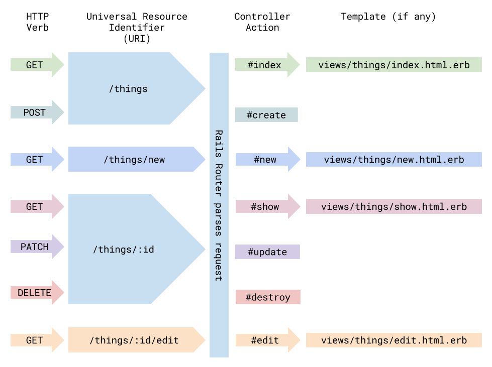

# Sinatra Forms and REST 📑

## Goals 🎩

- [ ] Review CRUD as it relates to RESTful routes 🛣
- [ ] Review the structure of MVC architecture as manifest in Sinatra 🎙
- [ ] Build out a RESTful Sinatra game review web app 🕹
- [ ] Write and handle a form 📑
- [ ] Compare and contrast `render` and `redirect` ⚖️

---

## CRUD and REST 🛣

- Creating, Reading, Updating, Deleting
  - You can perform CRUD actions using ActiveRecord
- REpresentational State Transfer-ful Routes
  - Provide design pattern that allows for easy data manipulation
  - Nicer for users and nicer for developers to have everything consistent
  - Many CRUD actions are different HTTP request methods that occur on the same resource path

## Building a RESTful Application 🎙

### General Procedure 🎤

1. Determine domain model
2. Create application model
  A. Write and deploy database migrations
  B. Double-check database schema
  C. Define ActiveRecord models and associations
  D. Seed database and explore in console
3. Create controllers
  A. Decide on user stories
  B. Write RESTful routes corresponding to stories with request method and resource path
  C. Define controller actions for each route
4. Create views
  A. Write HTML+Ruby (ERB) to leverage interface with model through controller
  B. Make views as required by controller

### Game Review 🕹

- Domain and Application Model
  - `Game` has `:title`, `:description`, `:rating`, `:image_url`
  - `Review` has `:title`, `:description`, `:rating`
  - `Game` has many `Review`
- Controllers
  - Game: All 7 RESTful routes
  - Review
    - `show`
    - `new`
    - `create`
    - `update`
    - `delete`
- Views: as needed

## Render vs. Redirect ⚖️

### Render (`erb`) ➡️

- The `erb` syntax allows you to render partials, it knows to look in our views folder to render a certain view
- You can pass information via `instance variables` to your views from the controller
- `erb` does NOT create a new `get` request instead it's a reference to a file that will load in the browser

### Redirect (`redirect`) ⤴️

- A redirect will make a separate http request to the server
- Does not allow for `instance variables` to be passed along

### When to use each one 🔁

General rule of thumb: If it’s a *successful* `post`, `patch`, `delete`, or an *unsuccessful* `get` do a redirect (otherwise render)

Things to keep in mind:

1. Don’t make a new HTTP request when not necessary
2. Remember that a “render” doesn't change the url of the page, make sure the urls make sense to the user when you use render.
3. When we submit a form successfully we want to redirect to prevent resubmission of that form

---

## Takeaways 💰

- [x] RESTful routes map CRUD actions for models to HTTP request methods and resource paths
- [x] Web applications are best built from the bottom up
- [x] Renders and redirects are means of guiding/controller user interaction on site

## Resources 🔗

- [MDN: Web Forms](https://developer.mozilla.org/en-US/docs/Learn/Forms)
- [Corneal: Sinatra App Generator](https://github.com/thebrianemory/corneal)
